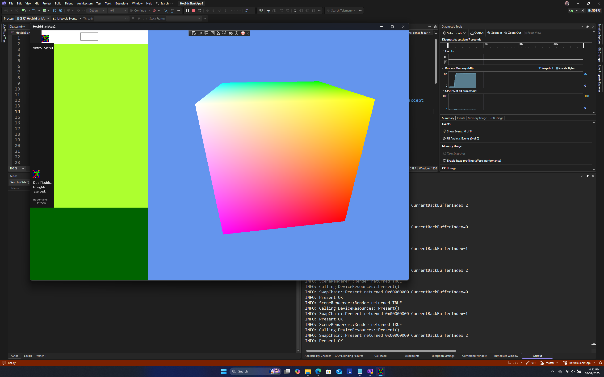

This is similar to Hot3dxBlankApp2WinrtVS2026 Repository except 
it was created in the Visual Studio 2026 Enterprise Previewto toolset v145.

This is a C17/C++20, UWP XAML Windows 10 & 11 Builds 10.0.19041 to 10.0.26100

using Visual Studio version 11201.20098.0

========================================================================
    C++/WinRT Hot3dxBlankApp2 Project Overview
========================================================================

This project demonstrates how to get started writing XAML apps directly
with standard C++, using the C++/WinRT SDK component and XAML compiler 
support to generate implementation headers from interface (IDL) files.
These headers can then be used to implement the local Windows Runtime 
classes referenced in the app's XAML pages.

Steps:
1. Create an interface (IDL) file to define any local Windows Runtime 
    classes referenced in the app's XAML pages.
2. Build the project once to generate implementation templates under 
    the "Generated Files" folder, as well as skeleton class definitions 
    under "Generated Files\sources".  
3. Use the skeleton class definitions for reference to implement your
    Windows Runtime classes.

========================================================================
Learn more about C++/WinRT here:
http://aka.ms/cppwinrt/
========================================================================

Known Issues:
- VS 2026 will not install the necessary NuGet Packages by default.
  You may need to manually install the following NuGet packages:
    - Microsoft.Windows.CppWinRT" version="2.0.250303.1" 
    - Microsoft.Web.WebView2" version="1.0.3595.46" 
    - WinPixEventRuntime" version="1.0.240308001" 
  And place the packages folder in the solution drive directory. For Example: C:\Packages or D:\Packages
- Calling forth necessary packages can be done in the Visual Studio 2022 version of this program.
  at https://github.com/Hot3dx/Hot3dxBlankApp2

- Make sure to install the "C++ (v142) and (v143) and (v145 for VS2026) Universal Windows Platform tools" 
  workload in Visual Studio Installer.
- Ensure that your project is set to use the correct Windows SDK version.
- If you encounter build errors related to missing headers or libraries, 
  verify that the C++/WinRT extension is installed in Visual Studio.
- If you experience issues with XAML designer or IntelliSense, try restarting Visual Studio or rebuilding the project.
